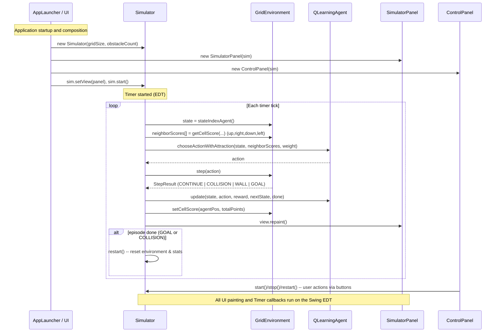

# Sequence Diagram: Simulator runtime

This Mermaid sequence diagram shows the runtime interactions between the UI, `Simulator`, `GridEnvironment`, `QLearningAgent`, `SimulatorPanel` and `ControlPanel` during normal operation.

